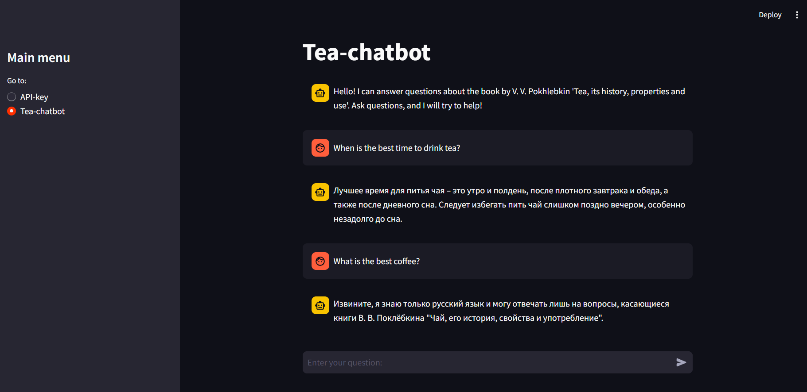

# Tea Bot 🍵🤖  

This project is a simple chatbot built using **Streamlit** and **LangChain**. The bot answers questions based on an uploaded **PDF** file. The source of information is the book **V. V. Pokhlebkin** "Tea: Its History, Properties, and Use".


## 🔗 Streamlit



---

## ⛏️ Project Architecture  
The project consists of **three Python files** and a **PDF book**:
- Two **.py** files handle separate pages of the application.
- One **.py** file integrates them.
- The main chatbot logic is implemented in **chatbot.py**.

## ⚙️ Technologies Used  
- **LLM:** GPT-4o mini (optimal choice for price/performance)
- **GraphRAG**, including **FAISS**, to improve information retrieval
- **LangChain** for simplifying the code and improving usability
- **Streamlit** for creating the web interface

## 🚀 Running the Project  
### 1. Install Dependencies  
Create a virtual environment and install dependencies:
```bash
pip install -r requirements.txt
```

### 2. Run the Streamlit Application  
```bash
streamlit run main.py
```

## 📊 Features  
- Upload a PDF file
- Chatbot answering questions based on the book's content
- Support for semantic search in the text
- Interactive interface using **Streamlit**

## 🌟 Future Plans  
- Add support for multiple books
- Improve long-answer handling
- Optimize performance

---

🍀 Good luck and enjoy your tea! 🍵

